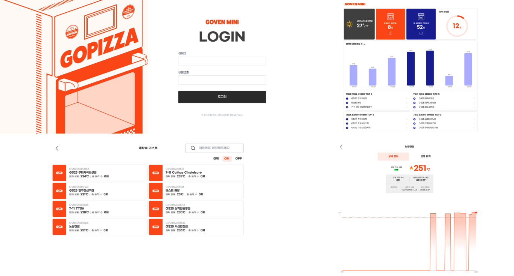

# GOPIZZA GOVEN MINI IoT 관리 시스템


## 프로젝트 개요

GOVEN MINI IoT 관리 시스템은 GS25 편의점에 설치된 고피자의 특허 기술 '고븐 미니(GOVEN MINI)' 오븐을 실시간으로 모니터링하고 관리하는 웹 애플리케이션입니다. 초소형, 초고온, 저전력 특성을 가진 고븐 미니 오븐은 편의점 환경에 최적화되었으며, 이 관리 시스템을 통해 전국 1,000개 이상의 GS25 매장에 설치된 모든 오븐의 상태와 성능을 원격으로 관리할 수 있습니다.




## 주요 특징

- **특허 받은 푸드테크 오븐 기술**: 초소형 사이즈, 적은 전기 사용량, 빠른 조리 시간을 갖춘 '고븐 미니'의 IoT 기술 적용
- **분산 네트워크 관리**: 전국 GS25 매장에 설치된 1,000대 이상의 고븐 미니 실시간 모니터링
- **데이터 기반 품질 관리**: 모든 매장에서 동일한 품질을 유지할 수 있도록 데이터 분석 및 설정 최적화


## 기술 스택

### 프론트엔드
- **프레임워크**: Next.js 14, React 18
- **언어**: TypeScript
- **상태 관리**: MobX
- **스타일링**: TailwindCSS, Emotion
- **데이터 시각화**: Visx(D3.js 기반)
- **API 통신**: React Query, Axios
- **지도 연동**: Google Maps API


## 프로젝트 구조

```
GovenMiniIoTManage/
├── api/                     # API 통신 모듈
│   ├── device.ts            # 디바이스 관리 API
│   ├── dashboard.ts         # 대시보드 데이터 API
│   └── auth.ts              # 인증 관련 API
├── components/              # 재사용 컴포넌트
│   ├── dashboard/           # 대시보드 관련 컴포넌트
│   ├── store-devices/       # 매장 기기 관련 컴포넌트
│   └── charts/              # 차트 컴포넌트
├── data/                    # 정적 데이터
├── hooks/                   # Custom Hooks
├── mobx/                    # MobX 스토어
├── pages/                   # 페이지 컴포넌트
│   ├── index.tsx            # 대시보드 메인
│   ├── login.tsx            # 로그인 페이지
│   └── store-devices/       # 매장별 기기 관리 페이지
├── public/                  # 정적 파일
├── styles/                  # 스타일 관련
└── util/                    # 유틸리티 함수
```


## 개발 환경 설정

```bash
# 1. 의존성 설치
yarn install

# 2. 개발 서버 실행
yarn dev

# 3. 프로덕션 빌드
yarn build

# 4. 프로덕션 서버 실행
yarn start
```


## 주요 기능

### IoT 기기 관리
- **실시간 상태 모니터링**: 각 오븐의 전원 상태, 온도, 작동 시간 실시간 확인
- **온도 데이터 그래프**: 시간대별 온도 변화를 시각화하여 표시
- **매장별 필터링**: 매장 유형, 이름, 상태별 오븐 목록 필터링
- **원격 제어**: 오븐 설정 원격 변경 및 업데이트

### 데이터 분석 및 대시보드
- **매장별 사용량 통계**: 오븐 사용 빈도 및 패턴 분석
- **성능 지표 모니터링**: 전력 사용량, 평균 조리 시간 등 성능 지표 추적
- **사용 이력 및 로그**: 오븐 사용 이력과 오류 로그 조회
- **매장 순위**: 사용량 기준 매장 순위 제공

### 시스템 관리
- **사용자 관리**: 권한별 접근 제어 및 계정 관리
- **설정 템플릿**: 최적 조리 설정 템플릿 관리
- **알림 시스템**: 이상 감지 시 담당자 자동 알림


## IoT 기술 적용

- **실시간 데이터 수집**: 각 오븐의 온도, 전력 사용량, 조리 시간 등 실시간 데이터 수집
- **클라우드 기반 분석**: AWS 클라우드 서비스 활용 데이터 저장 및 분석
- **양방향 통신**: 원격 설정 변경 및 펌웨어 업데이트 지원
- **AI 활용 예정**: 향후 동일한 품질 유지를 위한 AI 기반 자동 조정 기능 구현 예정
